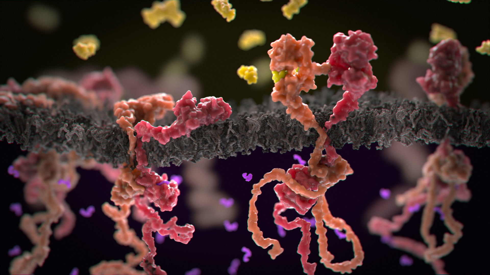
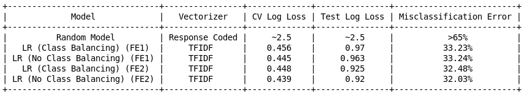

 <b>Personalized Cancer diagnosis using Genetic Data (Feature Engineering)</b> 

<h1>1. Business Problem</h1>

<h2>1.1. Description</h2>

 Source: https://www.kaggle.com/c/msk-redefining-cancer-treatment/ 

 Data: Memorial Sloan Kettering Cancer Center (MSKCC)

 Download training_variants.zip and training_text.zip from Kaggle.
 

<h6> Context:</h6>

 Source: https://www.kaggle.com/c/msk-redefining-cancer-treatment/discussion/35336#198462

<h6> Problem statement : </h6>

 Classify the given genetic variations/mutations based on evidence from text-based clinical literature. 

<h2>1.2. Source/Useful Links</h2>

 Some articles and reference blogs about the problem statement
 
 1. https://www.forbes.com/sites/matthewherper/2017/06/03/a-new-cancer-drug-helped-almost-everyone-who-took-it-almost-heres-what-it-teaches-us/#2a44ee2f6b25
2. https://www.youtube.com/watch?v=UwbuW7oK8rk 
3. https://www.youtube.com/watch?v=qxXRKVompI8

<h2>1.3. Real-world/Business objectives and constraints.</h2>

* No low-latency requirement.
* Interpretability is important.
* Errors can be very costly.
* Probability of a data-point belonging to each class is needed.

<h1>2. Machine Learning Problem Formulation</h1>

<h2>2.1. Data</h2>

<h3>2.1.1. Data Overview</h3>

- Source: https://www.kaggle.com/c/msk-redefining-cancer-treatment/data
- We have two data files: one conatins the information about the genetic mutations and the other contains the clinical evidence (text) that  human experts/pathologists use to classify the genetic mutations. 
- Both these data files are have a common column called ID
- 
 
    Data file's information:
    <ul> 
        <li>
        training_variants (ID , Gene, Variations, Class)
        </li>
        <li>
        training_text (ID, Text)
        </li>
    </ul>

<h3>2.1.2. Example Data Point</h3>

<h6>training_variants</h6>

ID,Gene,Variation,Class 
0,FAM58A,Truncating Mutations,1  
1,CBL,W802*,2  
2,CBL,Q249E,2  
...

<h6> training_text</h6>

ID,Text  
0||Cyclin-dependent kinases (CDKs) regulate a variety of fundamental cellular processes. CDK10 stands out as one of the last orphan CDKs for which no activating cyclin has been identified and no kinase activity revealed. Previous work has shown that CDK10 silencing increases ETS2 (v-ets erythroblastosis virus E26 oncogene homolog 2)-driven activation of the MAPK pathway, which confers tamoxifen resistance to breast cancer cells. The precise mechanisms by which CDK10 modulates ETS2 activity, and more generally the functions of CDK10, remain elusive. Here we demonstrate that CDK10 is a cyclin-dependent kinase by identifying cyclin M as an activating cyclin. Cyclin M, an orphan cyclin, is the product of FAM58A, whose mutations cause STAR syndrome, a human developmental anomaly whose features include toe syndactyly, telecanthus, and anogenital and renal malformations. We show that STAR syndrome-associated cyclin M mutants are unable to interact with CDK10. Cyclin M silencing phenocopies CDK10 silencing in increasing c-Raf and in conferring tamoxifen resistance to breast cancer cells. CDK10/cyclin M phosphorylates ETS2 in vitro, and in cells it positively controls ETS2 degradation by the proteasome. ETS2 protein levels are increased in cells derived from a STAR patient, and this increase is attributable to decreased cyclin M levels. Altogether, our results reveal an additional regulatory mechanism for ETS2, which plays key roles in cancer and development. They also shed light on the molecular mechanisms underlying STAR syndrome.Cyclin-dependent kinases (CDKs) play a pivotal role in the control of a number of fundamental cellular processes (1). The human genome contains 21 genes encoding proteins that can be considered as members of the CDK family owing to their sequence similarity with bona fide CDKs, those known to be activated by cyclins (2). Although discovered almost 20 y ago (3, 4), CDK10 remains one of the two CDKs without an identified cyclin partner. This knowledge gap has largely impeded the exploration of its biological functions. CDK10 can act as a positive cell cycle regulator in some cells (5, 6) or as a tumor suppressor in others (7, 8). CDK10 interacts with the ETS2 (v-ets erythroblastosis virus E26 oncogene homolog 2) transcription factor and inhibits its transcriptional activity through an unknown mechanism (9). CDK10 knockdown derepresses ETS2, which increases the expression of the c-Raf protein kinase, activates the MAPK pathway, and induces resistance of MCF7 cells to tamoxifen (6). ... 

<h2>2.2. Mapping the real-world problem to an ML problem</h2>

<h3>2.2.1. Type of Machine Learning Problem</h3>

    
            There are nine different classes a genetic mutation can be classified into => Multi class classification problem
   
      
    

<h3>2.2.2. Performance Metric</h3>

Source: https://www.kaggle.com/c/msk-redefining-cancer-treatment#evaluation

Metric(s): 
* Multi class log-loss 
* Confusion matrix 

<h3>2.2.3. Machine Learing Objectives and Constraints</h3>

 Objective: Predict the probability of each data-point belonging to each of the nine classes.

 Constraints:

* Interpretability
* Class probabilities are needed.
* Penalize the errors in class probabilites => Metric is Log-loss.
* No Latency constraints.

<h2>2.3. Train, CV and Test Datasets</h2>

 Split the dataset randomly into three parts train, cross validation and test with 64%,16%, 20% of data respectively
 
 ## What we did in this experiment?
 
 The task for this experiment is to correctly classify a given genetic variations/mutations into one of the nine classes, based on evidences gathered from text-based clinical literature. There was a no latency requirement, which means it is okay to take some time before arriving at a conclusion.  Here, we should keep in mind that making an incorrect assumption can be costly, as it will severely affect a patient's line of treatment. We will build a classifier which will give probabilistic outputs instead of just giving us the class labels.

Our dataset for this task consists of three features - Gene, Variants, Text. We will use these three features to build a cancer detection model.

In the EDA sections there are some very useful information about the structure of the given data. We have 3321 data points unequally distributed among 9 classes. The distribution of the number of sentences tells us that there are almost 50% data points which has 427 sentences at max. Almost 75% data points have 744 number of sentences. There's however a sudden increase beyond the 75th percentile mark. We will keep this in mind as we move along. 

As a general rule of thumb, the pre-processing is done by removing unwanted words, characters and converting the entire text to lower case. Converting the text to lower case is important because, the model will treat the capital and small letters as different words even if they are the same!  

I have some new features. These are, MergedText - Each of the variation data point merges with the the corresponding text data into one single string. TopWordsInText - This feature will give us the top 75 most frequently occurring words in a given text data. We will use these features to get tfidf representations to train our model. In feature engineering part 1, we will use the gene and variations data to build a tfidf-vectorizer. With this tfidf-vectorizer we will encode the text data, and use this as a feature. This is very relevant because, we have already seen that gene and variation itself brought down the log loss to almost half of a random model.  

We need to be careful while splitting the data into train, test and cross validation datasets. This is because we want the three datasets to have almost equal distributions of classes. We can draw a simple plot to check these distributions. 

Now, it's time for use to see what are the top most frequently occurring words for a given class. I have used word clouds for this purpose. The word clouds can straight away give us relevant keywords which helps us understand what type of words are mots common for every class. For example we see keywords like "breast cancer", "lung cancer", "ovarian cancer", "gene mutation", "tyrosie kinase", "egfr mutation","amino acids" and so on, belonging to each of the classes. Here I have given just a few examples. We also see that there are some classes which talks about some particular variation/mutant type more frequently than others. 

Why have we chosen our metric to be 'log loss' ?

As we have discussed above, we will use our Key Performance Indicator to be 'log' loss. Minimising the Log Loss is basically equivalent to maximising the accuracy of the classifier. In order to calculate Log loss, the classifier must actually assign a probability value for each of the class labels. Ideally as the predicted class probabilities improve, the Log loss keeps on reducing. Log loss penalises the classifier very heavily if it classifies a Class 1 to be Class 4 and vice versa. For example, if for a particular observation, the classifier assigns a very small probability to the correct class then the corresponding contribution to the Log Loss will be very large. Naturally this is going to have a significant impact on the overall Log Loss for the classifier,which will then become higher. But, in other scenario if the classifier assigns a high probability value to the correct class, then the Log loss will reduce significantly. Now, imagine a scenario where the model doesn't predict probability scores. It only predicts class labels. In this case, class labels can be either 0 or 1. So we won't get a deep understanding or any interpretability about why a particular pair of question has been labeled as either 0 or 1. Chosing the KPI as Log loss gives us this freedom. We can interpret the models. We can say this two questions are 95% similar or 80% similar, instead of just bluntly classifying them as duplicates.

For deep understanding of log loss please visit: https://datawookie.netlify.com/blog/2015/12/making-sense-of-logarithmic-loss/
(https://datawookie.netlify.com/blog/2015/12/making-sense-of-logarithmic-loss/)

Now, the minimum value of log loss in the ideal scenario would be 0. But what about the maximum? For this we will build a random model. This random model, which is like the worst model that can be made for this problem, gave us a log-loss of almost 2.5. This gives us an upper limit. We now know what is the worst log loss that our model can give? With this in mind we will try to bring the log loss as close to zero as possible.

Typically for high dimensional data, logistic regression and linear SVMs work very well. We can use KNN, Naive Bayes for lower dimensional data representations. In a seperate experiment we can also try models like XGBoost and LightGBM to extract features. Anyway, as the first step we need to encode the text feature into numerical data. How? We have two ways  - a simple one hot encoding of the text corpus using Bag of Words approach and a response coding approach. We will choose the appropriate featurization based on the ML model we use. For this problem of multi-class classification with categorical features, one-hot encoding is better for Logistic regression while response coding is better for Random Forests. 

### Very Important note about response coding: Avoiding response leakage.

1. We have to be extremely careful not to use the test and cross validate data for response coding. This is because we don't the issue of data leakage.
2. Suppose we have a variant V2 present in Test / Cross Val dataset. But V2 is not present in Train. So in that case, while building the response bales for V2, we will just assign equal probability values to each of the 9 array values. Proba = 1/9 for each og them. 
3. We will take the help of laplace smoothing in order to achieve this. Without laplace smoothing, we would get a 0/0 error. 
4. We are seeing the data that is present in the cross validation and test data during the time of training. So we are literally leaking the information that is present in test/cv data at the time of training.

This should be strictly avoided, as we do not want a data leakage issue.

After all this is done, we will perform univariate analysis using all the features. As we can see, all the individual features brought down the log loss by a significant amount. Now we will combine these three features in various ways to get the best possible log loss that we could get. 

The other metric we have chosen for this problem is the confusion matrix. By suing the confusion matrix, precision matrix and the recall matrix we can actually see what percentage of points are correctly classified in each of the 9 classes. 

We will use various models like naivae bayes, k-nearest neighbors, logistic regression, random forest etc. Before we begin training our models we have to make sure that we build our model such that it is interpretable. Not only the model will tell us the class type, but it will also tell us the exact reason why it thinks a given query point belongs to a certain class.

First we will use TFIDF features and run all the models. Here we see that the best log loss we get is from the logistic regression model with balanced class values. Instead of using all the words in the dataset, we will use only the top 1000 words which occur in the text feature. 

Now, since we know that logistic regression performs better for high dimensional data, we will repeat our experiment by encoding the text to BOW representations using bigrams and unigrams. We have seen in the word clouds before how unigrams and bigrams are so important in determining the context of any class. The BOW features with bigrams performed fairly well. But, there wasn't any drastic improvement in the log loss.

With the initial first cut solution, we will move onto the feature engineering stage, where we will perform hyperparameter tuning and try and reduce the log loss as much as possibele.

In stage 1 of feature engineering, we will combine the words present in the Gene column with those present in the Variation column. We will build a tfidf vectorizer using this corpus and use this to transform the text column. We will use this as our 4th feature and see a how a logistic regression performs on this model. Using this feature we were able to reduce the log loss to almost 0.95, which is a significant drop.

In feature engineering stage 2, we will add a 5th feature. We will take the 75 most frequently occurring words in each text and use this corpus to build a tfidf vector representation of the top words. Using this method, I was able to bring down the log loss to 0.92 with a 31% misclassification error. This is by far the best model that we have seen.

Given below are the model performances for all the models tried so far. 

### Comparison of the best model performances achieved.

